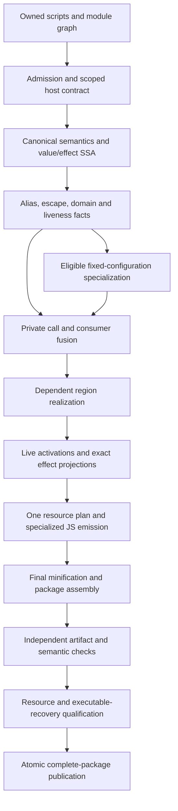

# Selected design: an offline whole-root region compiler

Status: **selected for bounded prototype investment, not implemented or security-qualified**. The three worker ballots chose this target unanimously after nine specialist briefs and cross-domain review. They also unanimously deferred extra state-encoding machinery. See [the decision ledger](41-decision-ledger.md) for actual votes and objections.

## Objective and claim boundary

Make an attacker spend materially more effort recovering an independently usable or meaningfully editable implementation of nontrivial authored behavior. Execution remains strictly offline, self-contained JavaScript. Ordinary builds require no online service or model. The design has no server secret, licensing service, trusted hardware or native/WASM execution backend.

The attacker knows Ruam, its compiler and build seed; can inspect every output file, alter code before load, instrument operations, inspect heaps and closures, choose inputs, reset sessions and learn across builds. Copying the complete artifact unchanged is always possible. The goal is measured recovery-cost amplification under specified attacks, not secrecy or unhookability.

No new protection performance was measured in this campaign. The proposed 5× pilot and 10× promotion objectives are acceptance targets, not outcomes. Numerical targets and evidence scope are defined in [the frozen slate](30-frozen-slate.md) and [attack protocol](04-attacks.md).

## The central hypothesis

Prior work repeatedly kept a reusable intermediate representation available to the attacker: an opcode/operand interface, decoded frame, original helper boundary, declarative configuration table, or simpler alternate execution lane.

This design first removes private source structure that need not exist at runtime, then transforms genuinely dependent computations as a unit. It emits one selected realization and preserves only the live state needed by subsequent computation. It does not ship every alternative implementation or describe the canonical program in client metadata.

The intended difference is concrete: an extractor should have to reconstruct application-specific dependencies rather than lift a shared semantic machine or dump the original configuration. A competent normalizer may still recover those dependencies cheaply. That is the first experiment and a reason to stop, not a defect to hide behind more layers.

## One system and one pipeline

All CLI, directory, library and browser-builder entry points must construct the same graph and invoke the same terminal writer. Presets, shielding, modules and optimization choices cannot select a parallel path that bypasses qualification. Public compatibility wrappers may preserve API convenience; they may not retain a legacy backend invisibly.

### Shared owner-side contracts

| Contract | Producer and consumers | Critical invariant |
| --- | --- | --- |
| FrozenSourceGraph and HostContract | Input snapshot; frontend, linker and admission | All supplied executable source is inventoried. Platform APIs cannot exempt supplied application/vendor code. |
| SemanticRoot and ValueEffectGraph | Canonical frontend; every transform | Values, coercions, aliasing, calls, possible throws and completion successors remain explicit; unknown facts stay conservative. |
| RegionContract | Analysis; fusion and synthesis | Exact input domains, live values, side effects, identities, and every exit are specified together. |
| ActivationPlan and ModuleCellContract | Liveness/alias planning; code generation | Distinct invocations remain distinct; genuinely shared bindings remain shared; no callback write is restored away. |
| TransformationWitness | Each transformation; independent final checker | Many-to-many correspondence and justified elimination, not one-node/count matching. Proof grades are explicit. |
| CostPlan | Shared planner; all emitters | Whole-artifact caps dominate local transform budgets. Failure rejects a plan/build, never silently leaves authored code native. |
| ArtifactEvidence | Final-byte checker and qualified test/attack jobs; writer | Reports bind actual final bytes and declared scope. Coverage, correctness, provenance and resistance are separate. |

These records remain owner-side. Client output contains generated JavaScript, required local assets and minimal loading metadata. No source maps, canonical IR, source-to-value tables, original bodies or owner reconstruction sidecars are published.

## Selected protection experiments

### 1. Fuse private computations and remove unnecessary state structure

Use exact call-target, alias and escape facts to inline closed private calls across authored functions and eligible module boundaries. Scalar-replace proven unobservable ordinary records and closure environments. Substitute consumers before deciding which intermediate values must be stored.

The first implementation handles immutable initialized module bindings and nonescaping own-data objects. Unknown properties, proxy/accessor exposure, observable identity and mutable external bindings block that transformation. It does not replace all objects with handles or proxies.

This can remove private helper APIs, property schemas and whole-frame handoffs, while reducing allocation. Compare it against ordinary optimization: scalarization may improve the attacker's view, so performance benefit alone earns no protection credit.

### 2. Realize dependent predicates and state updates together

For a bounded, proven int32/uint32/Boolean region, treat branch choice, state update and required outputs as one exact relation. Generate a different verified necessary dependency graph and emit one selected implementation directly. Begin with source-established domains, such as an authored coercion already executed at its proper effect point.

Do not bundle independent outputs and claim that a wide tuple is hard. Do not add canceling arithmetic, dead lanes or artificial polynomial degree. Each useful output projection must be attacked independently. A synthesis candidate must preserve exits and the order of all observable operations.

No optimistic type annotation or guard can justify shipping an easy equivalent implementation beside it. General generated logic stays in the whole-artifact attack surface; its easiest successful recovery bounds the claim. Large-loop resynthesis is deferred until small branch/state relations survive normalization and synthesis attacks.

### 3. Specialize private configuration with its evaluator

For a proven immutable, nonescaping ruleset, parser table or fixed evaluator configuration, partially evaluate the pair into residual JavaScript. Eliminate the generic interpreter/configuration pair where it is semantically unnecessary; then pass the residual computation through the same fusion and region pipeline.

This targets a real recovery shortcut: dumping a declarative program and reusing its interpreter. It is not string encryption. A symbolic decision-graph extractor or active learner may recover equivalent behavior more easily afterward, so this has a separate preregistered workload cohort and no automatic general-JavaScript claim.

### What the vote removed from the initial system

Additional private-state encoding/change-of-basis machinery (C06), encoding across effects or suspension (C13), and automated adversarial build search (C09) are deferred. The first experiment uses fixed qualified recipes and plain live state. If it survives, a later representation proposal needs an identified residual extraction point and a matched ablation showing added benefit.

Local-key hiding, chart multiplication, standalone MBA inflation, source-hash authenticity, hook-count scores and trace flooding are rejected as security foundations. Existing useful source-map, naming and publication hygiene remains useful without those claims.

## JavaScript behavior and unavoidable boundaries

The initial experiment admits complete closed synchronous roots, owned acyclic modules, qualified private object/closure patterns, exact scalar regions, and qualified ordinary host APIs. Every authored contribution follows the pipeline, including operations that do not qualify for stronger transformation.

Before a call, commit legitimately observable state at the original point. After unknown reentry, invalidate affected mutable facts and reread shared cells. For example, after `state.n++`, a callback that sets `state.n = 40` must make a subsequent read return 40; restoring an activation snapshot must not change that to 2. Include recursion, throw/finally and alias variants. Normal, return, throw, break and continue completions retain their targets and finally overrides.

Required host arguments, results, property effects, identities and scheduling remain observable. There is no promise to hide them. Shared language support is permitted when necessary, but a renamed operation+operands dispatcher, universal frame decoder or generic private-state projection is a new analysis target, not harmless infrastructure.

Source reflection is a public compatibility boundary. Attackers can use native `toString` to inspect generated source. The compiler does not promise to reproduce original authored source strings; legitimate application behavior depending on those strings is excluded or rejected when unresolved. Qualified ordinary DOM/event/function-timer callbacks need not be banned merely because the function escapes. No monkey-patched intrinsic is used to claim transparent original-source equivalence.

Initially reject eval, Function constructors, string timers (including literals), arbitrary runtime source, and unqualified async/generator/cyclic-module behavior. Precompiling literal eval can change CSP rejection and lexical semantics. Finite inventoried local imports require qualified native ordering. Later language expansion must retain these contracts and earn separate evidence; it cannot import September's generic dynamic interpreter and inherit the static compiler's result.

This initial support boundary is deliberately explicit. It is not a full-JavaScript release claim. If three realistic complete roots cannot fit without source rewrites, the admission experiment fails; do not select only toy arithmetic to hide that result.

## Verification and comparative evidence

Restore old semantic fixtures into an executor-neutral harness and retain every failure/rejection classification. Test final emitted bytes on each actual claimed engine and CSP/extension host. A Node VM simulation cannot qualify a browser. Preserve negative zero, NaN, BigInt errors, identities, descriptors, TDZ, coercion order, module cells and reentry; later support adds iterator and scheduling cases.

Use exact equivalence checks only where their domain supports them. General JavaScript transformations use justified templates and differential evidence, labeled accordingly. Mutate final branches, alias links, coercions and completion behavior while recomputing metadata/digests: the checker must detect behavioral disagreement, not merely mismatched hashes.

The primary attacker parses all output to SSA, partially evaluates known helpers, slices every useful output/state update, normalizes algebra and uses local sampling/synthesis. An AI-assisted lane may develop those tools; it is not limited to reading a large file once. This threat is informed by [CASCADE v2](https://arxiv.org/abs/2507.17691v2) and the [Xyntia/XSmir author tooling](https://github.com/binsec/xyntia), whose results do not themselves measure Ruam. Use a second independent attacker and whole-function learning as alternative routes.

Score independently extracted executable semantics or meaningful preregistered edits on hidden inputs and stateful histories. Do not require original names or exact source structure. Mere reprinting/transplantation is recorded separately. CPU, wall time, model budget, analyst work, queries, setup and marginal cross-build costs remain separate; a cheaper alternate route defeats an alleged gain.

Compare applicable protected intersections of main max, validated offline PR5, eligible PR7 scalar BPRF, minimally repaired September, ordinary optimizing compilation, and candidate ablations. Publish repair diffs. PR8's native rows are not protected competitors. Main's fixed `work()` microbenchmarks remain speed/calibration controls; a constant output learned in one query cannot demonstrate recovery difficulty.

## Ordered implementation work packages

| Order | Concrete work and likely reuse points | Evidence before proceeding |
| --- | --- | --- |
| W0 | Archive/pin controls; reproduce and minimally repair September's missing loop-layout path; audit the legacy negative-zero stack-encoding concern; restore pre-cutover semantic fixtures. Use existing compiler/emitter and historical tests, without deleting failing families. | Runnable baselines, recorded diffs, correct scoped observations, honest support table. No new security claim. |
| W1 | Build independent AST/SSA recovery and hidden-output scorer; qualify weak controls; select three representative complete roots plus recurrence/configuration controls. Adapt S4 protocol and existing attack tooling after removing proxy metrics. | Competent attacker, no owner-map leakage, frozen tasks/budgets, nontrivial variable-input/stateful workloads, admission without source edits. |
| W2 | Add bounded value/effect/alias analysis and one common plan around WIP canonical/region/source-program machinery. Implement C03 plus C04 with ordinary scalarized code first. | Correctness and resource baselines; comparison against ordinary optimization; no universal hidden fallback. |
| W3 | Add one C05 branch/state relation family and whole-region validation; implement C07 as a separate residualization experiment. Reuse specialized emission patterns only after exactness checks. | Ablations: plain optimization, fusion-only, fusion+joint realization; config specialization separate. Eight builds/specimen; first reusable extractor run. |
| W4 | Stop or advance at the 2× early recovery rejection screen. Survivors run the frozen 5× pilot objective and stricter 10× promotion objective, confidence/censoring analysis and conjunctive runtime/size/memory/build envelope. | Independent evidence against applicable historical controls and all alternate lanes. A failing or inconclusive comparison earns no win. |
| W5 | Only after success, extend complete-root admission across further object/exception cases, module cycles, generators and async. Repeat real-host and whole-artifact attacks at each expansion. | Each claimed surface independently qualified. Rejections remain visible; no support-by-native-pass-through. |

These are dependency-ordered work packages, not elapsed-time promises. No product implementation was authorized or performed as part of this ideation campaign. The selected design does not require C06/C09/C13 to complete W0–W4.

## Stop conditions and remaining uncertainty

Stop protection expansion if the first generic normalizer recovers valid behavior at comparable cost, the new admission scope excludes representative programs, semantic observations differ, or cost budgets fail. Keep independently useful performance, compiler correctness and packaging improvements with accurately limited claims.

The most serious risk is that a specialized regional compiler produces cleaner, more recoverable JavaScript. The selected design is worth testing because it attacks concrete extraction shortcuts and can be falsified early. It is not already “much more secure.” That judgment requires the measurements above, rather than another vote or a larger implementation.
