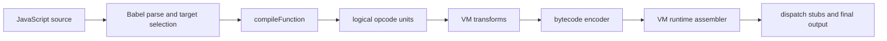
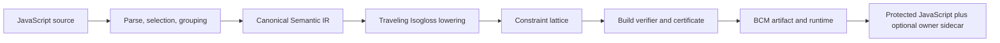

# Traveling Isogloss — Rank 1 Implementation Plan

**Date:** 2026-07-24  
**Status:** Implementation-ready replacement plan  
**Source:** Rank 1 in [Project Kaleidoscope — Ruam Gen-2 Ideation Results](2026-07-24-ruam-gen2-ideation-results.md)  
**Decision:** Replace Ruam's VM bytecode execution model with Traveling Isogloss. The completed product has one execution engine—the Boundary Constraint Machine—and contains no legacy VM runtime, VM fallback, bytecode encoder, or backend selector.

## 1. Outcome

Traveling Isogloss will replace the current compiler-to-bytecode-to-VM path. A selected root function and all of its child units will compile into a **Boundary Constraint Machine (BCM)**:

- The emitted artifact contains two populations of locally ambiguous semantic cells, reusable operand reservoirs, a neighborhood graph, and one mutable carrier state per root group.
- No emitted function owns a fixed instruction stream.
- A semantic operation becomes uniquely selectable only when the current left cell, current right cell, and the carrier's history-derived witness meet at the active boundary.
- Executing that operation changes cell phase and moves the carrier to a new boundary.
- Completing, throwing from, yielding from, or suspending a call closes a lineage segment and leaves the group at a different contract gate for the next invocation.
- The state lives in the emitted runtime closure. It is server-free, CSP-safe, and persistent across calls for the lifetime of that loaded artifact.
- A developer-only sidecar can map opaque boundary motion back to source spans without shipping that map in the protected artifact.

Implementation occurs on a replacement branch. The old VM may be invoked temporarily as a differential test oracle while the BCM is incomplete, but it is not a product backend and is deleted at cutover. No release described by this plan offers a VM/Isogloss choice or silently falls back to VM execution.

This is a research execution model and full runtime replacement, not a claim that program behavior becomes unrecoverable. Its defensible security claim is narrower:

> The emitted artifact has no stable site-to-operation function body. Recovering useful meaning requires replaying a history-dependent carrier through input-dependent boundary states, producing an execution-specific lineage rather than extracting one canonical instruction stream.

## 2. Locked semantic decisions

These decisions remove ambiguity before implementation begins.

### 2.1 What a dialect cell is

A cell is a reusable constraint bundle over the runtime handler catalog. It does not store an opcode, handler index, operand, or source location.

Each cell contains phase-selectable clauses. A clause describes:

- candidate semantic signature classes;
- permitted stack-shape transitions;
- permitted effect classes;
- permitted control exits;
- synthetic per-build dimensions derived from an isolated PRNG stream;
- references to reusable operand reservoirs;
- neighboring cells that may become boundary partners after an exit.

Every clause must be locally ambiguous. Under the default profile, it must match at least eight handlers.

### 2.2 What the boundary is

The boundary is the ordered triple:

```text
left cell clause + right cell clause + carrier witness
```

The left clause alone is ambiguous. The right clause alone is ambiguous. Their static intersection must remain ambiguous. Only the addition of the current carrier witness may select one handler and one operand projection.

The carrier witness is derived from prior boundary motion, the current cell phases, the current frame shape, and a per-group lineage accumulator. It is not a stored opcode token.

### 2.3 What moves

The active boundary moves after every semantic transition, not merely after a public call:

1. Resolve the unique handler and operand projection at the active boundary.
2. Execute the handler.
3. Classify the result as an exit such as fallthrough, branch-true, branch-false, call, return, throw, await, or yield.
4. Apply the exit-specific local refold.
5. Flip or rotate the crossed cell phase.
6. Move the carrier to the selected neighboring boundary.
7. Update the lineage accumulator and epoch.

Call completion is a stronger transition: it closes the current lineage segment and lands the carrier at a contract gate from which the next invocation target and inputs can route it to an entry anchor.

### 2.4 State scope

There is exactly one active carrier per **root group**:

- A root group contains one selected root function and every child bytecode unit produced from nested functions or class members.
- An escaped child closure remains attached to its originating root group.
- Different selected root functions receive independent lattices and independent carriers.
- There is no file-global carrier because it would create unnecessary coupling across unrelated APIs.
- There is no per-unit carrier because that would turn the design into independently moving instruction streams and weaken the core concept.

### 2.5 Calls, recursion, reentrancy, async, and generators

JavaScript remains single-threaded at each semantic step, so one carrier can serve nested and suspended work without cloning:

- A nested or reentrant call pushes a carrier resume gate, routes the same carrier to the callee's contract entry, and returns through a generated continuation corridor.
- Recursion uses the same mechanism. No persistent state is stored in the current VM's hoisted sync-handler slots.
- `await` and `yield` park the machine frame and a continuation gate, then release the carrier.
- A later resume reacquires the group's current carrier and routes it to that continuation gate before executing the next semantic transition.
- Multiple async calls may be suspended simultaneously, but only one carrier is active during any JavaScript turn. Suspended frames are not additional boundaries.
- Resume order follows the host's existing Promise/generator scheduling. Ruam must not add a new queue that changes observable ordering.

### 2.6 Failure and exception state

Boundary motion is not transactional and is never rolled back:

- A handled throw selects an exception exit and continues through the lattice.
- An uncaught throw selects a terminal throw exit, moves the carrier to a contract gate, then rethrows the original value.
- A rejected async call does the same at rejection.
- User-visible side effects and representational evolution therefore advance together.

This avoids impossible rollback promises around arbitrary JavaScript side effects and makes exceptional use part of the artifact's history.

### 2.7 Persistence boundary

Version 1 persistence is in-memory for the lifetime of the loaded artifact:

- Repeated calls in the same page, worker, or Node process see the evolved lattice.
- Reloading or restarting creates a fresh state from the emitted initial carrier.
- Cross-reload persistence, local storage, remote state, and license-bound state providers are explicitly out of scope for the first release.

### 2.8 Correctness proof boundary

Ruam will not claim a formal proof of arbitrary JavaScript behavior. It will prove a narrower and testable property:

1. The semantic compiler produces canonical semantic IR.
2. For every reachable canonical IR node and exit edge, the build-time BCM verifier proves that the corresponding boundary state resolves exactly the intended handler and operand projection.
3. The verifier proves that the chosen exit refold reaches the boundary family corresponding to the intended successor IR node.
4. Handler differential tests against native JavaScript remain the behavioral authority for each semantic handler.
5. End-to-end differential tests compare native JavaScript, the TypeScript BCM reference runtime, and the emitted BCM runtime.

During implementation only, the old VM may provide an additional mismatch signal. It is not part of the proof boundary, release test matrix, or shipped product.

The build result includes verifier statistics and a certificate digest. The certificate itself remains a build artifact or owner sidecar; it is not required by the production runtime unless `runtimeChecks` is explicitly enabled.

## 3. Non-negotiable invariants

An implementation is not Traveling Isogloss unless all of these hold.

| ID | Invariant | Automated enforcement |
|---|---|---|
| TI-01 | No emitted per-function `Instruction[]` or equivalent linear operation stream exists. | Artifact schema test and adversarial extractor |
| TI-02 | Every individual cell clause matches at least `minCellAnonymity` handlers. | Build verifier |
| TI-03 | The static intersection of the active left and right clauses still matches at least two handlers. | Build verifier |
| TI-04 | Left + right + current carrier witness resolves exactly one handler and operand projection for every reachable state. | Build verifier and property tests |
| TI-05 | A non-boundary neighboring pair never resolves exactly one handler under the current witness. | Build verifier |
| TI-06 | Every semantic transition changes carrier edge, cell phase, witness, lineage, or more than one of them. | Build verifier |
| TI-07 | Every canonical CFG edge has a corresponding verified refold edge, including exception and finally edges. | CFG bisimulation check |
| TI-08 | One root group has one live carrier, including during recursion, reentrancy, generator suspension, and async suspension. | Runtime assertions in tests |
| TI-09 | Runtime state is root-group-scoped and stored only in the BCM runtime closure. | Architecture test and code review |
| TI-10 | Production output uses no `eval`, `new Function`, `debugger`, dynamic script construction, or network dependency. | CSP/security tests |
| TI-11 | All generated identifiers use `NameRegistry`; all random streams use `deriveSeed()`. | Naming tests and code review |
| TI-12 | An owner trace map is never embedded in production code. | Output inspection test |
| TI-13 | Removed VM-specific options fail with an actionable migration error; none are silently accepted or ignored. | Removed-option tests |
| TI-14 | The cutover tree contains no VM interpreter, VM loader, bytecode encoder, physical opcode shuffle, backend selector, or VM fallback path. | Source inventory and package-surface tests |

## 4. Explicit non-goals

- Do not market the design as mathematically irreversible.
- Do not encrypt source semantics and call the ciphertext a dialect.
- Do not put two complementary opcode shares in adjacent cells.
- Do not emit a hidden opcode stream and merely move a decoder over it.
- Do not retain the old VM as a fallback, alternate preset, compatibility mode, debug engine, or hidden recovery path.
- Do not mutate generated JavaScript source text at runtime.
- Do not use self-modifying native code, WebAssembly, workers, timers, storage, or a server to make the mechanism work.
- Do not reimplement the JavaScript semantic catalog from scratch; extract the language-level handler logic from `ruamvm` before deleting the VM scaffold.
- Do not add performance hardening until the reference model and verifier are correct.
- Do not combine the first implementation with Evidential Phase Succession, Anisomorphic Ruleworlds, licensing, remote policy, or cross-installation state.

## 5. Current architecture and replacement seams

The legacy pipeline being removed is:



The replacement pipeline is:



There is no execution-backend branch in the target architecture.

The replacement seams in the current code are:

| Current location | Existing responsibility | Replacement action |
|---|---|---|
| `src/transform.ts` | Owns every pipeline phase and both shared/shielded VM branches | Rewrite as the single semantic-IR → Isogloss orchestration path |
| `src/compiler/index.ts` | Produces logical opcodes and applies VM optimizer assumptions | Return canonical semantic units; remove physical VM lowering |
| `src/compiler/emitter.ts` | Emits opcode and operand pairs | Become a semantic-IR emitter with build-only source origins and stable node IDs |
| `src/compiler/basic-blocks.ts` | Recovers basic blocks after compilation | Replace with a canonical CFG carrying typed exits |
| `src/compiler/optimizer.ts` | Produces VM superinstructions | Delete after any engine-independent optimizations are moved to semantic IR |
| `src/ruamvm/handlers/*` | Defines JavaScript semantic behavior as AST builders | Move language-level handlers into `src/runtime/handlers/` and remove opcode-table coupling |
| `src/ruamvm/builders/interpreter.ts` | Couples handler construction to VM dispatch | Extract the semantic handler catalog, then delete the VM scaffold |
| `src/ruamvm/builders/loader.ts` | Decodes and caches bytecode units | Replace with the BCM group loader and carrier-state store |
| `src/ruamvm/builders/runners.ts` | Routes unit IDs to VM execution | Replace with contract-token runners |
| `src/ruamvm/assembler.ts` | Assembles the VM runtime | Replace with the BCM runtime assembler; delete the VM assembler at cutover |
| `src/types.ts` | Mixes public options and VM bytecode internals | Replace with Ruam/Isogloss public types; delete VM bytecode types |
| `src/presets.ts` | Resolves VM hardening booleans | Redefine every preset in Isogloss terms |
| `src/option-meta.ts` | Describes VM-oriented booleans | Replace with typed Isogloss, artifact, and common-source options |
| `src/naming/*` | Central identifier system | Add Isogloss scopes and remove VM-only claims after cutover |
| `src/structural-choices.ts` | Derives VM runtime variation | Replace with lattice/runtime structural choices using isolated streams |
| `test/helpers.ts` | Native-versus-VM equivalence | Make native-versus-reference-BCM-versus-emitted-BCM the permanent oracle set |

## 6. Public API and configuration

### 6.1 Public type redesign

Replace `VmObfuscationOptions` rather than retaining it as an alias:

```ts
export type IsoglossProfile = "research" | "balanced" | "hardened";

export interface TravelingIsoglossOptions {
	profile?: IsoglossProfile;
	minCellAnonymity?: number;
	expansion?: 2 | 3 | 4;
	runtimeChecks?: boolean;
	ownerTrace?: "off" | "sidecar" | "sidecar+runtime";
}

export interface RuamOptions {
	isogloss?: TravelingIsoglossOptions;
	preset?: PresetName;
	targetMode?: "root" | "comment";
	threshold?: number;
	preprocessIdentifiers?: boolean;
	target?: TargetEnvironment;
	// New engine-independent artifact protections only.
}
```

Delete `ExecutionModel`, `ResolvedVmOptions`, and `VmObfuscationOptions` from the public surface. Publish a migration guide rather than a compatibility alias.

Defaults:

```ts
isogloss.profile = "research"
isogloss.minCellAnonymity = 8
isogloss.expansion = 2
isogloss.runtimeChecks = false
isogloss.ownerTrace = "off"
```

Validation:

- `minCellAnonymity` must be an integer from 4 through 64.
- `expansion` must be 2, 3, or 4.
- `ownerTrace: "sidecar+runtime"` is never enabled by a preset.
- Unknown nested Isogloss properties fail fast.
- Removed VM options fail with `RUAM_REMOVED_VM_OPTION` and a migration hint.

### 6.2 Detailed build API

The primary API returns verifier data and an optional owner sidecar:

```ts
export interface ProtectionBuildResult {
	code: string;
	diagnostics: BuildDiagnostic[];
	stats: {
		engine: "traveling-isogloss";
		rootGroupCount: number;
		unitCount: number;
		originalBytes: number;
		outputBytes: number;
		expansionRatio: number;
	};
	ownerTrace?: IsoglossOwnerSidecar;
}

export function protectCode(
	source: string,
	options?: RuamOptions
): ProtectionBuildResult;

export function obfuscateCode(
	source: string,
	options?: RuamOptions
): string {
	return protectCode(source, options).code;
}
```

Public-surface rules:

- `protectCode()` is the primary API.
- `obfuscateCode()` may remain as a string-returning convenience name because it does not imply VM execution.
- Add `protectFile()` and `runProtection()`.
- Delete `runVmObfuscation()` and `VmObfuscationOptions` in the replacement major version.
- Remove the `ruamvm` CLI binary alias; ship `ruam` only.
- Rename package description, keywords, documentation, and generated messages away from VM and bytecode terminology. Package-registry renaming is a separate release decision, but no runtime compatibility depends on the old package name.

### 6.3 CLI

Add:

```text
--isogloss-profile <research|balanced|hardened>
--isogloss-min-anonymity <4..64>
--isogloss-expansion <2|3|4>
--isogloss-runtime-checks
--owner-trace <path>
--runtime-owner-trace
```

Do not add `--execution-model`; there is only one engine. Refactor `src/cli.ts` to parse flags from generalized option metadata. Hand-written parsing remains only for input/output paths, help, version, and interactive mode.

`--owner-trace` writes the sidecar returned by `protectCode()` and implies `ownerTrace: "sidecar"`. `--runtime-owner-trace` upgrades it to `"sidecar+runtime"`.

Removed VM flags produce a concise error with the replacement concept where one exists; they never activate retained legacy code.

### 6.4 Presets

Replace the current VM preset contents with Isogloss-native definitions:

```ts
interface PresetDefinition {
	common: Partial<RuamOptions>;
	isogloss: Required<TravelingIsoglossOptions>;
	artifact: Partial<ArtifactProtectionOptions>;
}
```

| Preset | Isogloss expansion | Minimum anonymity | Runtime checks | Production intent |
|---|---:|---:|---|---|
| `low` | 2 | 8 | off | Smallest evaluable lattice |
| `medium` | 3 | 12 | off | Balanced lattice and artifact protection |
| `max` | 4 | 16 | on | Maximum verified lattice pressure |

No preset contains VM options, no resolver has a VM branch, and no profile can select the removed engine.

## 7. Internal type model

### 7.1 Canonical semantic IR

Move VM-internal data types out of public `src/types.ts` into `src/compiler/types.ts`.

Create `src/compiler/ir.ts`:

```ts
export type SemanticNodeId = number;

export interface SourceOrigin {
	file?: string;
	start: number;
	end: number;
	line: number;
	column: number;
}

export interface SemanticInstruction {
	id: SemanticNodeId;
	op: SemanticOp;
	operand: number;
	originId: number;
}

export type SemanticExit =
	| { kind: "fallthrough"; target: SemanticNodeId }
	| { kind: "branch-true"; target: SemanticNodeId }
	| { kind: "branch-false"; target: SemanticNodeId }
	| { kind: "exception"; target: SemanticNodeId }
	| { kind: "finally"; target: SemanticNodeId }
	| { kind: "return" }
	| { kind: "throw" }
	| { kind: "yield"; resume: SemanticNodeId }
	| { kind: "await"; resume: SemanticNodeId };

export interface SemanticUnit {
	id: string;
	rootGroupId: string;
	constants: ConstantPoolEntry[];
	nodes: SemanticInstruction[];
	exits: Map<SemanticNodeId, SemanticExit[]>;
	entryNode: SemanticNodeId;
	origins: SourceOrigin[];
	// Existing function metadata follows.
}
```

The canonical IR contains semantic operations before lattice lowering. During migration, rename the language-level members of `compiler/opcodes.ts` into `SemanticOp` and delete physical opcode concerns rather than preserving a VM-flavored IR.

The following legacy stages have no target equivalent and are removed at cutover:

- opcode shuffle and physical opcode maps;
- VM superinstruction fusion;
- block permutation as instruction-address rewriting;
- opcode mutation;
- rolling and incremental instruction ciphers;
- VM bytecode serialization.

Any optimization that remains useful must operate on canonical semantic IR or on the lattice topology and must preserve the verifier's source-node correspondence.

### 7.2 Semantic signature catalog

Create `src/compiler/semantic-signatures.ts` with one descriptor for every semantic operation:

```ts
export interface SemanticSignature {
	op: SemanticOp;
	operandKind:
		| "none"
		| "constant"
		| "register"
		| "scope-name"
		| "argc"
		| "jump"
		| "packed"
		| "unit-ref";
	stackInput: StackArity;
	stackOutput: StackArity;
	effect:
		| "pure"
		| "local"
		| "scope"
		| "object"
		| "call"
		| "control"
		| "exception"
		| "async";
	control:
		| "fallthrough"
		| "conditional"
		| "jump"
		| "call"
		| "return"
		| "throw"
		| "yield"
		| "await";
	mayThrow: boolean;
	readsThis: boolean;
	readsScope: boolean;
	syntheticDimensions: number;
}
```

Dynamic stack effects such as calls use a pure function of the operand. Every descriptor must be exhaustive through a `satisfies Record<SemanticOp, SemanticSignature>` check. A missing semantic operation must fail TypeScript compilation.

### 7.3 Root groups

Create `src/pipeline/groups.ts`:

```ts
export interface RootGroup {
	id: string;
	rootPath: NodePath<t.Function>;
	units: SemanticUnit[];
	entryContracts: EntryContract[];
	usedSemantics: Set<SemanticOp>;
	hasAsync: boolean;
	hasGenerator: boolean;
}
```

Group construction replaces both the normal shared-VM layout and the VM-shielding special case. Every selected root receives one lattice group; there is no shielding mode after cutover.

### 7.4 Lattice model

Create `src/isogloss/types.ts`:

```ts
export type CellId = number;
export type ClauseId = number;
export type ReservoirId = number;
export type ContractId = number;

export interface CandidateMask {
	words: Uint32Array;
	cardinality: number;
}

export interface DialectClause {
	id: ClauseId;
	phase: number;
	handlerCandidates: CandidateMask;
	operandFamilies: CandidateMask;
	stackShapeMask: number;
	effectMask: number;
	controlMask: number;
	syntheticMask: Uint32Array;
	neighborRefs: Uint32Array;
}

export interface IsoglossCell {
	id: CellId;
	dialect: 0 | 1;
	clauses: DialectClause[];
}

export interface OperandReservoir {
	id: ReservoirId;
	values: Int32Array;
	projections: Uint32Array;
}

export interface CarrierSeed {
	left: CellId;
	right: CellId;
	leftPhase: number;
	rightPhase: number;
	witness: number;
	epoch: number;
	lineage: number;
}

export interface EntryContract {
	id: ContractId;
	unitId: string;
	gate: CellId;
	anchorFamily: Uint32Array;
}

export interface IsoglossGroup {
	id: string;
	cells: IsoglossCell[];
	reservoirs: OperandReservoir[];
	contracts: EntryContract[];
	initialCarrier: CarrierSeed;
	flags: number;
}
```

The actual encoded runtime shape uses short randomized property names or array positions. These descriptive names exist only in TypeScript.

### 7.5 Build certificate

Create `src/isogloss/certificate.ts`:

```ts
export interface IsoglossCertificate {
	schemaVersion: 1;
	groupId: string;
	reachableStateCount: number;
	verifiedTransitionCount: number;
	minObservedCellAnonymity: number;
	minObservedPairAmbiguity: number;
	nonBoundaryUniqueResolutionCount: 0;
	cfgMismatchCount: 0;
	digest: string;
}
```

The digest detects accidental mismatch between the verified lattice and the encoded lattice during the build. It is not presented as cryptographic attestation.

## 8. Compilation algorithm

### 8.1 Capture source origin without changing every visitor

Extend `Emitter` with an origin stack:

```ts
emitter.withOrigin(node, () => {
	// Existing visitor body.
});
```

`emit()` copies the current origin ID onto the instruction. Wrap visitor entry points in `visitors/expressions.ts`, `visitors/statements.ts`, and `visitors/classes.ts`. Optimizations that combine nodes retain the ordered set of contributing origin IDs.

This data is build-only and is removed unless an owner sidecar is requested.

### 8.2 Build the canonical CFG

Extend `compiler/basic-blocks.ts` or add `compiler/cfg.ts` to produce typed exits:

1. Mark entry, jump targets, post-transfer positions, exception entries, finally entries, and jump-table targets as leaders.
2. Split canonical instructions into blocks.
3. Convert packed jump operands into explicit typed edges without mutating the original operand.
4. Add exceptional edges for every instruction covered by an exception range and marked `mayThrow`.
5. Add return, throw, await, and yield terminal/resume edges.
6. Validate every target exists and every nonterminal block has at least one exit.
7. Retain a map from block/node IDs back to source origins.

### 8.3 Produce boundary families

Create `src/isogloss/lower.ts`. For each semantic node:

1. Read its semantic signature.
2. Allocate `expansion` boundary variants. A variant is a distinct pair of reusable cell clauses and witness class that realizes the same semantic node.
3. Select left and right candidate sets that each include the intended handler and at least `minCellAnonymity - 1` decoys.
4. Require the static left/right intersection to contain at least two handlers.
5. Choose a carrier witness predicate that reduces the intersection to the intended handler.
6. Allocate an operand family that includes the intended projection plus decoys and reused values.
7. Connect each typed CFG exit to an eligible successor boundary variant.
8. Generate local phase changes so the next visit to the same semantic node prefers a different variant.
9. Reuse each nonterminal cell across at least two semantic nodes or two exit paths. A dedicated cell per instruction is forbidden.
10. Generate contract gates and non-semantic routing corridors for root entry, escaped child entry, reentrant entry, continuation resume, return, and uncaught throw.

All random choices use streams such as:

```ts
deriveSeed(fileSeed, `isogloss/group/${groupId}/cells`)
deriveSeed(fileSeed, `isogloss/group/${groupId}/clauses`)
deriveSeed(fileSeed, `isogloss/group/${groupId}/operands`)
deriveSeed(fileSeed, `isogloss/group/${groupId}/topology`)
deriveSeed(fileSeed, `isogloss/group/${groupId}/phases`)
```

No new ad hoc PRNG or XOR-derived stream is permitted.

### 8.4 Constraint generation strategy

Create `src/isogloss/constraints.ts`.

Use a deterministic bounded search:

1. Start from the handler set compatible with the target's broad stack, effect, control, and operand categories.
2. If the compatible set is too small, add synthetic dimensions and handler aliases that preserve semantics but change clause membership.
3. Sample candidate left and right supersets.
4. Reject a pair if either side is below the anonymity minimum.
5. Reject a pair if its static intersection has fewer than two members.
6. Generate a witness mask from the carrier predecessor family.
7. Reject if the three-way intersection is not exactly the target handler.
8. Reject if the pair uniquely resolves under any witness reachable at a non-boundary neighbor.
9. Stop after a fixed attempt budget.
10. On exhaustion, emit `RUAM_ISOGLOSS_CONSTRAINT_UNSAT` with the unit, semantic node, signature, minimum anonymity, and attempts. Never weaken the requested anonymity silently.

Rare handlers that cannot meet the requested anonymity receive generated semantic aliases from the existing handler-aliasing machinery. An alias is eligible only if differential tests prove it equivalent and its use does not expose a direct node-to-handler mapping.

### 8.5 Operand projection

Create `src/isogloss/operands.ts`.

Operands must not be stored beside their semantic node. Instead:

- Constants, register indices, scope-name indices, argument counts, unit references, and jump metadata are placed in typed reservoirs shared across the root group.
- A left clause selects a projection family.
- A right clause selects a transformation family.
- The carrier witness selects a slot within their intersection.
- The resolver reconstructs the effective operand into a local variable immediately before handler execution.
- At least half of reservoir entries must be referenced by more than one boundary family.
- Unused decoy reservoir entries are permitted only when they are structurally indistinguishable from used entries.

Control-flow targets are never reconstructed as instruction pointers. The handler returns an exit class; topology chooses the successor boundary.

### 8.6 Verify before encoding

Create `src/isogloss/verify.ts`.

The verifier performs a graph exploration from every entry contract and continuation contract:

```text
state = carrier edge + cell phases + witness class + semantic frame class
```

For each reachable state:

1. Compute left candidates.
2. Compute right candidates.
3. Assert local and pair ambiguity thresholds.
4. Apply the witness and assert one resolution.
5. Compare the handler and operand projection with the canonical semantic node.
6. Enumerate every legal exit of the canonical node.
7. Apply the corresponding refold.
8. Assert the successor boundary realizes the canonical successor node.
9. Assert the carrier changed.
10. Add the successor state to the worklist.

Loops require state abstraction so verification terminates. Phase and witness domains are finite by construction; epoch and lineage are reduced to the finite bits actually consumed by clauses. The verifier must reject a design that reads unbounded epoch or lineage values for semantic selection.

## 9. Runtime algorithm

### 9.1 Runtime components

Add `src/isogloss/runtime/`:

| File | Responsibility |
|---|---|
| `assembler.ts` | Dependency-tiered runtime factory and final result |
| `deserializer.ts` | Decode the BCM binary envelope into typed arrays |
| `loader.ts` | Cache decoded groups and initialize one carrier per group |
| `resolver.ts` | Compute the three-way boundary intersection |
| `operands.ts` | Reconstruct one effective operand from reservoirs |
| `carrier.ts` | Apply phase changes, refolds, contract routing, epoch, and lineage |
| `interpreter.ts` | Execute the shared handler catalog under BCM control |
| `runners.ts` | Dispatch opaque contract tokens, box `this`, and route sync/async/generator calls |
| `continuations.ts` | Park and resume await/yield/reentrant frames |
| `trace.ts` | Optional opaque runtime owner events |
| `checks.ts` | Optional local invariant checks for research/max builds |

Every emitted runtime fragment is built with the existing typed AST node system. Do not use template strings containing JavaScript.

### 9.2 Carrier state

The deserialized group cache owns:

```ts
interface RuntimeCarrierState {
	left: number;
	right: number;
	leftPhase: number;
	rightPhase: number;
	witness: number;
	epoch: number;
	lineage: number;
	activeDepth: number;
	frameStack: RuntimeFrame[];
	parked: Map<number, RuntimeContinuation>;
}
```

In emitted code, use compact arrays and NameRegistry-generated identifiers. The descriptive object form is for the reference runtime only.

### 9.3 Dispatch loop

The emitted interpreter loop is:

```text
route carrier to requested contract gate
create or resume frame
while frame is runnable:
    read active left/right clauses
    resolve one handler candidate using carrier witness
    reconstruct one operand
    execute shared semantic handler
    classify exit
    update carrier and cell phases
    emit optional opaque trace event
    route to successor, callee, continuation, or terminal contract
return, throw, yield, or await with native-equivalent values and scheduling
```

The handler catalog may be stable within a build; the prohibited mapping is a stable program-site-to-handler stream. Handlers describe the JavaScript language, while the moving boundary describes this program's behavior.

### 9.4 Semantic handler extraction

Do not duplicate handler bodies and do not retain a VM dispatch scaffold.

1. Move `src/ruamvm/handlers/*` to `src/runtime/handlers/*`.
2. Rename opcode-facing registry types to semantic-operation-facing types.
3. Extract generic stack, register, scope, exception, call, `this`, and completion helpers into `src/runtime/handler-context.ts`.
4. Make `buildHandlerCatalog()` return the catalog consumed directly by the BCM resolver.
5. Remove decoded-opcode arguments and physical opcode lookup from handler construction.
6. Delete `buildVmDispatchScaffold()`, the VM handler table metadata, and VM interpreter builders after the BCM runtime passes the corresponding semantic suites.

The source move is performed before final cutover so the reusable JavaScript language implementation survives deletion of `src/ruamvm/`.

### 9.5 Contract dispatch stubs

Replace `replaceFunctionBody()` with:

```ts
replaceFunctionWithDispatchStub(
	path,
	contractToken,
	dispatchBinding,
	stubOptions
)
```

The stub shape remains natural:

- rest parameters;
- direct lexical dispatcher call;
- regular functions forward `this`;
- arrows do not;
- constructors, `new.target`, home object, outer scope, and generator/async shape match the current behavior.

The token identifies an entry contract, not a unit body. It may be different per build and is generated through the root-group stream.

This avoids publishing runtime internals on `globalThis`. If a target shape requires global exposure, keep a target-specific **BCM** adapter and document why. Validate top-level `this`, script globals, ESM, CJS, and browser-extension behavior before cutover.

### 9.6 Runtime factory assembly

Assemble the generated dispatcher as a lexical binding when target semantics allow it:

```js
var <dispatch> = (function () {
	// Runtime and artifact state.
	return <dispatchFunction>;
})();
```

This avoids publishing BCM internals on `globalThis`. If a target shape requires global exposure, keep a target-specific BCM adapter and document why. Validate top-level `this`, script globals, ESM, CJS, and browser-extension behavior before cutover.

## 10. Binary format

### 10.1 Envelope

Create `src/artifact/format.ts` and `src/artifact/encode.ts`.

Use a single-engine versioned envelope:

```text
magic       4 bytes  "RUAM"
version     u8       1
flags       u16
groupCount  u32
payloads    length-prefixed Isogloss groups
```

There is no backend discriminator and no legacy bytecode payload variant. The generated code and BCM runtime are produced together, and round-trip format tests cover only the Isogloss schema.

### 10.2 BCM payload

Each group payload contains:

1. group metadata and flags;
2. unit-to-contract token table;
3. constant pools;
4. cell clause table;
5. candidate mask word table with deduplication;
6. operand reservoirs;
7. neighborhood/refold table;
8. initial carrier seed;
9. async/generator continuation metadata;
10. optional runtime-check digest.

Use `Uint8Array`, `Uint16Array`, `Uint32Array`, and `Int32Array` views after deserialization. Avoid nested runtime objects in the hot path.

### 10.3 No source or owner data in payload

The following are build-only:

- source spans;
- original function names beyond what JavaScript semantics require;
- canonical semantic node IDs;
- expected handler IDs;
- verifier witness paths;
- sidecar event descriptions.

An output-inspection test must deserialize every production payload and assert these fields are absent.

## 11. Owner view

### 11.1 Sidecar

Create `src/owner-view/types.ts` and `src/owner-view/build.ts`.

The sidecar schema contains:

```ts
interface IsoglossOwnerSidecar {
	schemaVersion: 1;
	buildId: string;
	groups: Array<{
		opaqueGroupId: string;
		contracts: Array<{
			opaqueContractId: number;
			sourceOrigin?: SourceOrigin;
			displayName?: string;
		}>;
		events: Array<{
			opaqueEventId: number;
			sourceOrigins: SourceOrigin[];
			semanticSummary: string;
		}>;
		certificate: IsoglossCertificate;
	}>;
}
```

`semanticSummary` is owner-facing text such as “read scoped binding” or “conditional exit,” not an emitted opcode number.

### 11.2 Runtime event sink

Only when `ownerTrace: "sidecar+runtime"`:

- The runtime looks up a documented trace sink once during initialization.
- The sink receives opaque IDs, epoch, from/to cell IDs, and exit class.
- The production artifact contains no source descriptions.
- Missing sinks are a no-op.
- Sink exceptions are caught and ignored so tracing cannot change protected program behavior.
- Runtime trace mode is excluded from performance and security claims.

Add `decodeIsoglossTrace(sidecar, events)` to convert opaque events into a replayable owner timeline.

## 12. Legacy option removal and reinterpretation

The replacement major version does not carry VM switches forward under misleading names.

| Existing option | Cutover action | Isogloss-native replacement |
|---|---|---|
| `targetMode` | Keep | Source-selection concern |
| `threshold` | Keep after deterministic PRNG refactor | Source-selection concern |
| `preprocessIdentifiers` | Keep | Pre-compilation transformation |
| `debugLogging` | Rename | `isogloss.ownerTrace` / development trace sink |
| `encryptBytecode` | Remove | Later `encryptArtifact` over the lattice payload |
| `debugProtection` | Remove, then redesign | Later engine-independent runtime protection |
| `dynamicOpcodes` | Remove | The BCM emits only required semantic families |
| `decoyOpcodes` | Remove | Later `decoyClauses` / semantic aliases |
| `deadCodeInjection` | Remove | Later inert, never-unique lattice corridors |
| `stackEncoding` | Remove, then redesign | Later engine-independent value representation |
| `rollingCipher` | Delete permanently | Assumes a linear instruction stream |
| `integrityBinding` | Remove, then redesign | Later lattice/runtime integrity binding |
| `vmShielding` | Delete permanently | Root groups already own independent lattices |
| `mixedBooleanArithmetic` | Remove, then redesign | Later generic runtime AST transform |
| `handlerFragmentation` | Delete permanently unless a new BCM rationale is proven | No VM handler table remains |
| `stringAtomization` | Remove, then redesign | Later final-runtime string transform |
| `polymorphicDecoder` | Remove, then redesign | Later artifact decoder transform |
| `scatteredKeys` | Remove | No core BCM key material |
| `blockPermutation` | Delete permanently | Lattice topology replaces instruction ordering |
| `opcodeMutation` | Delete permanently | No opcode table or physical opcodes remain |
| `bytecodeScattering` | Remove | Later `artifactScattering` over the lattice payload |
| `incrementalCipher` | Delete permanently | Assumes linear instruction epochs |
| `semanticOpacity` | Remove | Isogloss constraints, aliases, and predicates provide the native mechanism |
| `observationResistance` | Remove, then redesign | Later BCM-specific observation model |
| `target` | Keep | Final assembly concern |

Implement `validateRemovedVmOptions()` before parse/compile work. It reports:

- `RUAM_REMOVED_VM_OPTION`;
- every removed property or CLI flag;
- whether a concept was deleted permanently, renamed, or deferred for redesign;
- the migration replacement where one exists.

This validator is a tombstone list only. It imports no VM implementation and is removed after the documented migration window if desired.

## 13. Determinism and entropy refactor

The replacement engine requires repeatable failure reproduction. Refactor randomness before the spike:

1. Move `generateCryptoSeed()` out of `transform.ts` into `src/random/entropy.ts`.
2. Define an internal `BuildEntropy` containing the file seed and any independently generated salts.
3. Production uses `crypto.randomBytes`.
4. Tests call an internal `protectCodeWithContext()` with fixed entropy.
5. `collectTargetFunctions()` stops using `Math.random()` for `threshold`; it receives a PRNG derived with `deriveSeed(fileSeed, "target-selection")`.
6. Every BCM module receives either its already-derived seed or a scoped PRNG. No module reads global randomness.
7. Failure diagnostics always include the file seed, group ID, stream label, and attempt count.

Do not expose a deterministic public production seed unless a separate product decision approves reproducible builds and documents the security tradeoff.

## 14. File-by-file change ledger

### 14.1 New files

```text
packages/ruam/src/artifact/encode.ts
packages/ruam/src/artifact/format.ts
packages/ruam/src/compiler/cfg.ts
packages/ruam/src/compiler/ir.ts
packages/ruam/src/compiler/semantic-ops.ts
packages/ruam/src/compiler/semantic-signatures.ts
packages/ruam/src/compiler/types.ts
packages/ruam/src/isogloss/certificate.ts
packages/ruam/src/isogloss/constraints.ts
packages/ruam/src/isogloss/lower.ts
packages/ruam/src/isogloss/operands.ts
packages/ruam/src/isogloss/reference-runtime.ts
packages/ruam/src/isogloss/types.ts
packages/ruam/src/isogloss/verify.ts
packages/ruam/src/isogloss/runtime/assembler.ts
packages/ruam/src/isogloss/runtime/carrier.ts
packages/ruam/src/isogloss/runtime/checks.ts
packages/ruam/src/isogloss/runtime/continuations.ts
packages/ruam/src/isogloss/runtime/deserializer.ts
packages/ruam/src/isogloss/runtime/interpreter.ts
packages/ruam/src/isogloss/runtime/loader.ts
packages/ruam/src/isogloss/runtime/operands.ts
packages/ruam/src/isogloss/runtime/resolver.ts
packages/ruam/src/isogloss/runtime/runners.ts
packages/ruam/src/isogloss/runtime/trace.ts
packages/ruam/src/migration/removed-vm-options.ts
packages/ruam/src/options/resolve.ts
packages/ruam/src/owner-view/build.ts
packages/ruam/src/owner-view/decode.ts
packages/ruam/src/owner-view/types.ts
packages/ruam/src/pipeline/assemble.ts
packages/ruam/src/pipeline/groups.ts
packages/ruam/src/pipeline/select.ts
packages/ruam/src/random/entropy.ts
packages/ruam/src/runtime/handler-context.ts
packages/ruam/src/runtime/handler-catalog.ts
packages/ruam/src/runtime/handlers/*.ts
packages/ruam/src/runtime/nodes.ts
packages/ruam/src/runtime/emit.ts
packages/ruam/src/testing.ts
```

### 14.2 Existing files with behavioral changes

| File | Required edit |
|---|---|
| `src/transform.ts` | Rewrite as the single Isogloss build pipeline and return `ProtectionBuildResult` internally |
| `src/index.ts` | Export `protectCode`, `RuamOptions`, and owner-view APIs; remove VM-named exports |
| `src/browser-entry.ts` | Export the detailed Isogloss API and new types |
| `src/browser-worker.ts` | Use `protectCode()` and optionally transfer sidecar data |
| `src/types.ts` | Keep Ruam/Isogloss public types only; remove VM bytecode and VM option types |
| `src/compiler/index.ts` | Emit canonical `SemanticUnit` directly |
| `src/compiler/emitter.ts` | Emit `SemanticOp` nodes with IDs and source origins |
| `src/compiler/basic-blocks.ts` | Replace with or delegate to canonical CFG construction |
| `src/compiler/optimizer.ts` | Move genuinely semantic passes, then delete VM superinstruction logic |
| `src/presets.ts` | Replace preset contents with Isogloss/artifact settings |
| `src/option-meta.ts` | Replace VM options with typed Isogloss metadata and removed-option tombstones |
| `src/cli.ts` | Remove engine selection and VM flags; add Isogloss flags |
| `src/tuning.ts` | Replace VM intensity fields with lattice/runtime tuning |
| `src/structural-choices.ts` | Generate lattice and BCM-runtime choices only |
| `src/naming/claims.ts` | Replace VM claims with BCM runtime claims |
| `src/naming/compat-types.ts` | Replace `RuntimeNames` with Isogloss/runtime types; remove the compatibility framing |
| `src/naming/setup.ts` | Create root-group and BCM runtime scopes only |
| `scripts/generate-manifest.mjs` | Emit Isogloss option metadata plus migration tombstones |
| `package.json` | Remove `ruamvm` binary alias and VM/bytecode product description; prepare the replacement major version |
| `README.md` | Document the sole Isogloss engine, claim boundary, migration, examples, and limitations |
| `CLAUDE.md` | Replace VM architecture notes with BCM invariants while preserving relevant JavaScript semantic regressions |

### 14.3 Files and systems deleted at cutover

```text
packages/ruam/src/compiler/encode.ts
packages/ruam/src/compiler/opcodes.ts               # replaced by semantic-ops.ts
packages/ruam/src/compiler/block-permutation.ts
packages/ruam/src/compiler/incremental-cipher.ts
packages/ruam/src/compiler/opcode-mutation.ts
packages/ruam/src/compiler/rolling-cipher.ts
packages/ruam/src/ruamvm/                           # after generic handlers/nodes are moved
packages/ruam/test/security/*-cipher.test.ts         # replaced by artifact/Isogloss tests where applicable
packages/ruam/test/security/opcode-mutation*.test.ts
packages/ruam/test/security/vm-shielding.test.ts
```

Before deleting any test, classify it as:

1. JavaScript semantic correctness—port it to Isogloss;
2. generic security property—rewrite it for the lattice/artifact;
3. VM-mechanism-only—delete it with the mechanism.

The deletion PR must include a generated source inventory proving there are no imports of `ruamvm`, `BytecodeUnit`, physical opcode maps, VM runner names, VM options, or removed encoders.

### 14.4 Tests to add

```text
packages/ruam/test/isogloss/certificate.test.ts
packages/ruam/test/isogloss/cfg-bisimulation.test.ts
packages/ruam/test/isogloss/constraints.test.ts
packages/ruam/test/isogloss/format-roundtrip.test.ts
packages/ruam/test/isogloss/novelty-invariants.test.ts
packages/ruam/test/isogloss/operands.test.ts
packages/ruam/test/isogloss/persistence.test.ts
packages/ruam/test/isogloss/reference-runtime.test.ts
packages/ruam/test/isogloss/runtime-async.test.ts
packages/ruam/test/isogloss/runtime-classes.test.ts
packages/ruam/test/isogloss/runtime-closures.test.ts
packages/ruam/test/isogloss/runtime-control-flow.test.ts
packages/ruam/test/isogloss/runtime-core.test.ts
packages/ruam/test/isogloss/runtime-exceptions.test.ts
packages/ruam/test/isogloss/runtime-generators.test.ts
packages/ruam/test/isogloss/runtime-reentrancy.test.ts
packages/ruam/test/isogloss/seed-stress.test.ts
packages/ruam/test/isogloss/semantic-signatures.test.ts
packages/ruam/test/isogloss/sidecar.test.ts
packages/ruam/test/isogloss/static-extractor.test.ts
packages/ruam/test/migration/removed-vm-options.test.ts
packages/ruam/test/migration/no-legacy-vm.test.ts
packages/ruam/test/options/metadata-drift.test.ts
```

## 15. Implementation sequence

Each phase ends in a reviewable state. Development may call the legacy VM explicitly from migration tests until Phase 10, but product entry points never choose between engines: they either execute through the BCM or report that an unfinished semantic surface is not yet available on the replacement branch. No automatic VM fallback is permitted.

### Phase 0 — Freeze the legacy baseline and replacement contract

**Work**

1. Record the current VM's correctness results, build time, output size, bootstrap time, execution time, and retained memory as versioned JSON benchmark artifacts.
2. Save representative generated outputs for core, closure, exception, class, async, generator, and max-preset fixtures.
3. Classify every existing test as JavaScript semantics, generic protection, or VM-mechanism-only.
4. Add architecture records for:
   - full VM replacement and no fallback;
   - canonical semantic IR;
   - one carrier per root group;
   - non-transactional boundary motion;
   - in-memory-only persistence;
   - bounded correctness/security claims.
5. Add deterministic entropy injection and remove `Math.random()` from target selection without changing legacy behavior.

**Exit gate**

- Existing suite, typecheck, and build pass before replacement work begins.
- Fixed entropy reproduces identical output.
- Benchmark JSON and fixture inventory are committed so later comparisons do not require retaining VM code.
- The no-backend-selector/no-fallback architecture record is approved.

**Effort envelope:** 2–4 engineer-days.

### Phase 1 — Extract the semantic compiler and handler catalog

**Work**

1. Rename language-level logical operations from `Op` to `SemanticOp`.
2. Split public API types from compiler IR types.
3. Add semantic node IDs, source origins, typed CFG exits, and exhaustive semantic signatures.
4. Move generic AST nodes, emitter, handler context, handler registry, and language handlers from `src/ruamvm/` into `src/runtime/`.
5. Remove physical opcode/shuffle parameters from the extracted catalog.
6. Add direct native-JavaScript differential tests for each semantic family.
7. Keep a thin migration-only adapter that allows the old VM tests to consume canonical semantic IR until Phase 10; do not expose it publicly.

**Exit gate**

- Every `SemanticOp` has a signature descriptor and native differential coverage.
- The current semantic suites pass through the extracted catalog.
- `src/runtime/` has no imports from VM encoder, shuffle, cipher, loader, or dispatch modules.
- No `ProtectionBackend`, `VmBackend`, `executionModel`, or backend selector has been introduced.

**Effort envelope:** 7–12 engineer-days.

### Phase 2 — Build-only lattice generator and verifier

**Initial semantic scope**

- constants and arguments;
- register load/store;
- stack operations;
- integer/number/string arithmetic;
- equality and ordering comparisons;
- unconditional and conditional control flow;
- return and return-void.

**Work**

1. Implement cells, clauses, reservoirs, topology, entry contracts, and carrier seeds.
2. Implement bounded deterministic constraint search.
3. Generate at least two boundary variants per semantic node.
4. Implement CFG-to-lattice verification and certificates.
5. Implement the hostile static extractor used by novelty tests.

**Exit gate**

- 10,000 generated small semantic programs produce valid certificates.
- At least 256 fixed seeds pass per curated fixture in extended CI.
- TI-01 through TI-07 are mechanically checked.
- The extractor cannot recover a site-to-handler map without carrier replay.
- Constraint failures are reproducible and include the seed, group, node, signature, and attempt count.

**Stop condition**

Stop and redesign if uniqueness requires a stored expected-handler token, direct next-operation pointer, hidden bytecode stream, or complementary opcode shares.

**Effort envelope:** 8–14 engineer-days.

### Phase 3 — TypeScript reference BCM

**Work**

1. Implement a readable TypeScript resolver, operand projector, carrier, and frame model.
2. Execute the Phase 2 subset directly from verified lattices.
3. Compare native JavaScript, a canonical semantic-IR reference evaluator, and the BCM reference runtime.
4. Verify repeated calls change carrier state while preserving results.
5. Verify loops revisit different boundary variants.
6. Model terminal throws and post-error carrier validity.

**Exit gate**

- Zero mismatches across the randomized subset corpus.
- Repeated identical inputs return identical JavaScript values while producing distinct valid lineages.
- Resolver diagnostics explain a mismatch down to group, state, clauses, witness, projected operand, and CFG edge.
- The reference runtime has no import from `src/ruamvm/`.

**Effort envelope:** 6–10 engineer-days.

### Phase 4 — Emitted synchronous BCM runtime

**Work**

1. Implement the single-engine artifact envelope and BCM encoding.
2. Implement AST-built deserializer, loader, resolver, operand projector, carrier, and sync interpreter.
3. Consume the extracted semantic handler catalog directly.
4. Emit contract-token function stubs.
5. Add memory-persistent root-group state and optional runtime invariant checks.
6. Route `protectCode()` through the BCM for the supported synchronous surface. Unsupported constructs produce explicit development errors; they never fall back to VM.

**Exit gate**

- Synchronous arithmetic, strings, arrays, objects, functions, and control flow pass against native JavaScript.
- Production output contains no canonical IR, direct handler token, source origin, or owner map.
- Node, browser, and browser-extension CSP fixtures pass for the supported surface.
- Every generated identifier uses NameRegistry.

**Effort envelope:** 10–16 engineer-days.

### Phase 5 — Scope, closures, classes, and reentrancy

**Work**

1. Add scope-chain and closure contracts.
2. Keep escaped child closures attached to their originating root-group carrier.
3. Add call, construct, home-object, `new.target`, and `this` transitions.
4. Add class, getter, setter, `super`, and computed method behavior.
5. Add reentrant carrier routing for getters, setters, proxies, `valueOf`, and callbacks.
6. Preserve one active carrier across nested and recursive calls.

**Exit gate**

- All ported closure, scope, class, and `super` semantic suites pass against native JavaScript.
- Known `NEW_CLASS`, home-object, computed-method, and this-boxing regressions have BCM tests.
- Escaped closures remain correct after unrelated calls evolve their root group.
- Reentrant calls never duplicate carrier state.

**Effort envelope:** 10–18 engineer-days.

### Phase 6 — Exceptions and finally

**Work**

1. Represent catch/finally edges directly in topology.
2. Route thrown handler values through exception exits.
3. Preserve completion type/value through nested finally paths.
4. Handle break, continue, return, and throw through one or more finally regions.
5. Land uncaught throws at terminal contract gates before rethrowing the original value.

**Exit gate**

- Every relevant exception/finally regression in `CLAUDE.md` is ported and passes against native JavaScript.
- Native and BCM event traces agree for nested catch/finally programs.
- A subsequent call after an uncaught error executes from a valid evolved carrier.

**Effort envelope:** 8–14 engineer-days.

### Phase 7 — Async and generators

**Work**

1. Add await/yield suspension contracts.
2. Park frames without cloning carriers.
3. Route the current carrier to resumed continuations in host scheduling order.
4. Support interleaved promises and generators within one root group.
5. Clean up terminal or abandoned continuations without append-only history.
6. Prove the optional trace sink cannot alter scheduling.

**Exit gate**

- Ported async and generator suites pass against native JavaScript.
- Event-order tests compare side-effect logs, not only final values.
- Two interleaved calls preserve native ordering.
- Only one carrier is active at every instrumented semantic step.
- Rejection followed by a later successful invocation works.

**Effort envelope:** 12–20 engineer-days.

### Phase 8 — Public API, CLI, presets, browser worker, and owner view

**Work**

1. Finalize `RuamOptions`, `protectCode()`, file/directory APIs, and build-result schemas.
2. Remove `VmObfuscationOptions`, `runVmObfuscation()`, and execution-model concepts.
3. Replace preset contents with Isogloss-native tuning.
4. Replace CLI VM flags with Isogloss flags and removed-option errors.
5. Update the option manifest and browser worker.
6. Implement the owner sidecar, opaque runtime events, and replay decoder.
7. Update README and migration documentation.

**Exit gate**

- The public type surface contains no VM-named execution types.
- CLI help, presets, browser worker, and manifest describe one engine.
- Sidecar data is absent from production code.
- Removed options fail before parse/compile work with actionable messages.

**Effort envelope:** 6–10 engineer-days.

### Phase 9 — Isogloss-native hardening

Add hardening only when it has a lattice or engine-independent meaning:

1. artifact encryption;
2. artifact scattering;
3. final-runtime string atomization;
4. generic runtime MBA transforms;
5. engine-independent debug protection;
6. value representation hardening;
7. decoy clauses and semantic aliases;
8. lattice/runtime integrity binding;
9. BCM-specific observation resistance.

For each feature, add one option, one design note, isolated tests, seed stress, performance attribution, and only then preset coverage.

Never restore rolling cipher, incremental cipher, opcode mutation, physical-opcode shuffling, VM shielding, or block permutation.

**Exit gate**

- `low`, `medium`, and `max` contain only Isogloss-native or engine-independent protections.
- Feature-pair and feature-triple matrices pass.
- No hardening creates a stable site-to-handler map or hidden instruction stream.

**Effort envelope:** 12–24 engineer-days.

### Phase 10 — Destructive legacy removal and product cutover

**Work**

1. Move the final reusable handler/node code out of `src/ruamvm/`.
2. Port all JavaScript-semantic tests and generic protection tests.
3. Delete VM-only tests and implementation modules listed in Section 14.3.
4. Delete VM encoder, interpreter, loaders, runners, assemblers, physical opcodes, shuffles, ciphers, mutation, permutation, and shielding.
5. Remove `ruamvm` imports, CLI alias, options, types, package language, and generated manifest entries.
6. Remove the migration-only VM oracle adapter.
7. Run a source/package inventory that fails on any legacy execution symbol.
8. Cut the replacement major release only after the full Isogloss suite passes; there is no release with a fallback.

**Exit gate**

- `rg` finds no production references to `ruamvm`, `VmBackend`, `BytecodeUnit`, physical opcode maps, VM dispatch/loader names, or removed VM options outside the migration guide and removed-option tombstones.
- Package contents include no VM runtime or bytecode encoder.
- Every supported source program executes only through the BCM.
- The full typecheck, build, Node, browser, worker, browser-extension, seed, and randomized suites pass.
- Deleting the old VM changes no passing Isogloss result because no product path referenced it before deletion.

**Effort envelope:** 5–10 engineer-days.

### Phase 11 — Adversarial review and release qualification

**Work**

1. Build an internal extractor with full format/runtime knowledge.
2. Measure body location, reusable-sequence recovery, concrete-invocation explanation, and next-lineage prediction.
3. Hook resolver, handler catalog, operand projection, and carrier independently.
4. Test whether a trace from one lineage transfers to another.
5. Benchmark against native JavaScript and the frozen Phase 0 legacy measurements.
6. Conduct external design/security review before declaring the replacement release stable.

**Release gate**

- Correctness is perfect across the declared JavaScript support surface.
- A static format-aware extractor cannot recover a history-independent site-to-operation body.
- A trace from one lineage does not directly decode another lineage without replay.
- Median output size is at most 3× the frozen legacy VM measurement for the same fixture and at most the separately documented absolute budget.
- Median steady-state execution is at most 3× the frozen legacy measurement; P95 is at most 5×.
- Bootstrap is at most 2× the frozen legacy measurement.
- Memory reaches a stable bound; carrier history never appends indefinitely.
- Node, browser, worker, and browser-extension CSP targets pass.
- Section 14.3's deletion inventory and TI-14 pass.

**Kill criteria**

End or radically redesign the replacement if any remains true:

- the artifact requires a hidden linear instruction stream;
- unique resolution requires a stored expected-handler token;
- the lattice reduces to a direct node-to-handler table without replay;
- async equivalence requires serializing host-visible work;
- carrier state grows unboundedly;
- correctness depends on favorable seeds;
- straightforward optimization cannot bring execution below 12× or size below 10× the frozen legacy measurement;
- the practical mechanism is only control-flow flattening plus indirection.

**Effort envelope:** 8–15 engineer-days plus external review.

## 16. Validation strategy

### 16.1 Per-commit checks

From `packages/ruam`:

```sh
bun run typecheck
bun test
bun run build
```

During focused development:

```sh
bun test test/isogloss
bun test test/migration/removed-vm-options.test.ts
bun test test/migration/no-legacy-vm.test.ts
```

### 16.2 Seed tiers

| Tier | Seeds | When |
|---|---:|---|
| Local fast | 8 per focused fixture | Every implementation loop |
| Pull request | 32 per curated fixture | Every PR |
| Extended CI | 256 per curated fixture | Merge gate |
| Nightly/release | 1,024 per high-risk fixture plus randomized corpus | Nightly and release candidate |

High-risk fixtures include:

- backward jumps;
- forward branch targets;
- nested switch/continue;
- nested return-through-finally;
- caught and uncaught exceptions;
- recursive closures;
- getters/proxies that reenter;
- escaped closures;
- multi-level `super`;
- sparse arrays and iterators;
- two interleaved async calls;
- generator throw/return;
- repeated calls after an exception.

### 16.3 Differential oracle

Extend `test/helpers.ts` to support:

```ts
assertEquivalentToNative(source, options)
assertReferenceAndEmittedBcmAgree(source, options)
assertEventTraceEquivalent(source, options)
assertCarrierEvolves(source, calls, options)
```

For serializable results, compare values. For side effects, compare an explicit event log. For errors, compare constructor, name, message where specified by JavaScript, and event order. Do not require generated stack text to be identical unless Ruam explicitly guarantees it.

Before Phase 10, migration-only tests may also compare against the legacy VM to diagnose refactor errors. Delete those calls with the VM oracle adapter at cutover.

### 16.4 Property suites

Add generators for:

- small canonical IR graphs;
- loop and branch graphs;
- exception-region graphs;
- candidate masks at edge cardinalities;
- operand reservoir reuse;
- cell phase cycles;
- root/child contract graphs;
- async continuation interleavings.

Every minimized failure prints a fully reproducible seed and serialized canonical IR/lattice pair.

### 16.5 Novelty tests

`static-extractor.test.ts` must use a deliberately hostile parser with full knowledge of the format. It should fail the build if it finds:

- a linear array correlated one-to-one with canonical semantic nodes;
- a field whose value directly names the handler for a site;
- a left/right pair whose static intersection is unique;
- a direct next-instruction pointer;
- source origins or owner summaries in production payload;
- a carrier transition that leaves all state unchanged;
- a cell used by only one semantic node when reuse was required.

This is an architecture regression test, not a cryptographic security proof.

### 16.6 Performance suite

Extend `scripts/bench.mjs` and `scripts/bench-attribution.mjs` with:

- Isogloss profile and tuning values;
- original bytes, encoded payload bytes, runtime bytes, and sidecar bytes;
- build time split into parse, canonical compile, lattice generation, verification, encoding, and emit;
- bootstrap time;
- first call;
- repeated call;
- recursion;
- loop-heavy;
- object/property-heavy;
- exception-heavy;
- async interleave;
- peak and retained memory where supported.

Report ratios against native JavaScript and the frozen Phase 0 legacy benchmark JSON. The benchmark harness must not import or retain the legacy VM after Phase 10.

## 17. Risk register

| Risk | Early signal | Mitigation |
|---|---|---|
| The representation collapses into opcode secret sharing | Adjacent pair uniquely identifies handler | Enforce pair ambiguity and third history-derived witness |
| The graph is just bytecode with renamed pointers | One node owns one cell pair and one successor | Require cell reuse, multiple boundary variants, and exit-specific local refolds |
| Constraint search explodes | Frequent attempt-budget exhaustion | Signature aliases, mask deduplication, bounded profiles, detailed UNSAT diagnostics |
| Verifier state space explodes on loops | Epoch/lineage create unbounded states | Consume only finite phase/witness projections; reject unbounded semantic dependence |
| Shared handler reuse leaks a fixed body | Sites directly reference handler indices | Resolver enumerates catalog through constraints; no site reference |
| Runtime is too large | Per-node clauses dominate payload | Cell reuse, mask interning, typed-array packing, profile-controlled expansion |
| Runtime is too slow | Catalog scan dominates | Bitset intersection, precomputed compatible families, word-level unique-bit detection |
| Reentrancy corrupts carrier state | Proxy/getter callbacks produce mismatches | One carrier frame stack and explicit resume gates; dedicated reentrancy suite |
| Async changes observable order | Event logs differ despite equal final values | Reuse host scheduling; never serialize complete calls |
| Owner view becomes an attack oracle | Production artifact exposes map | Sidecar separation; runtime emits opaque IDs only when explicitly enabled |
| Semantic extraction accidentally preserves VM coupling | `src/runtime/` imports physical opcode or VM loader modules | Import-boundary tests and extraction before deletion |
| Cutover strands unported semantics | A test is deleted because BCM does not pass it | Mandatory semantic/generic/VM-only test classification and review |
| Legacy fallback survives invisibly | A product path imports `ruamvm` or accepts `executionModel` | TI-14 source/package inventory and no-legacy test |
| Removed options silently degrade | Old flag parses but changes nothing | Tombstone validator with actionable hard failure |
| History grows forever | Memory rises per call | Fixed-width phase, epoch, lineage, bounded parked frames, no append-only log |

## 18. Review and commit slicing

Use small commits/PRs with the following boundaries:

1. deterministic entropy, frozen legacy measurements, and test classification;
2. public build result type without engine selection;
3. semantic operation rename, IR, origins, and CFG;
4. generic handler/node extraction out of `ruamvm`;
5. semantic signatures and native handler differential tests;
6. lattice types, constraints, verifier, and certificate;
7. TypeScript reference BCM;
8. single-engine artifact format and encoder;
9. emitted synchronous BCM runtime and contract stubs;
10. scopes, closures, classes, and reentrancy;
11. exceptions and finally;
12. async and generators;
13. API, CLI, presets, manifest, and removed-option migration;
14. owner sidecar and replay;
15. each Isogloss-native hardening feature separately;
16. destructive VM/test/options/package removal;
17. adversarial and performance release report.

Move the generic handlers before deleting `src/ruamvm/`, but do not combine that mechanical move with BCM semantic changes. Do not combine a new hardening feature with correctness work. The destructive deletion remains its own auditable change.

## 19. Definition of done

Traveling Isogloss has replaced the VM only when:

- [ ] `protectCode()` is the primary build API and every protected function executes through the BCM.
- [ ] No public `executionModel`, `VmObfuscationOptions`, `runVmObfuscation()`, or `ruamvm` CLI alias remains.
- [ ] The production source and package contain no VM interpreter, bytecode encoder, physical opcode map, VM loader/runner, VM fallback, or backend abstraction.
- [ ] The `src/ruamvm/` directory is deleted after reusable semantic handlers and AST utilities are moved.
- [ ] The artifact contains no linear instruction stream.
- [ ] One carrier persists per root group and visibly evolves across calls.
- [ ] Every cell and pair ambiguity invariant is verified at build time.
- [ ] Canonical CFG and lattice topology pass the bisimulation verifier.
- [ ] Native JavaScript, reference BCM, and emitted BCM agree across the declared support surface.
- [ ] Closures, classes, `this`, `super`, recursion, reentrancy, exceptions, finally, async, and generators pass.
- [ ] Removed VM options fail explicitly with migration guidance.
- [ ] Node, browser, worker, and browser-extension CSP targets pass.
- [ ] Owner trace data is sidecar-only and runtime events are opt-in and opaque.
- [ ] All randomness is seed-isolated and reproducible in tests.
- [ ] All generated names use NameRegistry.
- [ ] Seed stress and randomized tests have no flakes.
- [ ] Adversarial tests show no history-independent site-to-operation body.
- [ ] Performance, output size, bootstrap, and bounded-memory release gates pass against native and frozen legacy measurements.
- [ ] README, package metadata, CLI help, and security language describe Isogloss as Ruam's sole engine.
- [ ] External design/security review approves the replacement release.

## 20. Recommended first implementation move

The first code change should **not** create an Isogloss cell or introduce a backend interface. It should freeze the old measurements, then extract canonical semantic IR and the reusable JavaScript handler catalog from the VM-specific directory.

The first genuine research milestone is:

> Compile straight-line and branching arithmetic functions into a verified in-memory lattice, execute them in the TypeScript reference BCM, and demonstrate that repeated calls traverse different boundary variants while native JavaScript, the semantic-IR evaluator, and the BCM remain identical.

That milestone tests the new execution model before paying for binary encoding, emitted runtime generation, the full JavaScript surface, or destructive VM removal. Once the complete BCM passes the release gates, the legacy VM is deleted rather than retained as an option.
